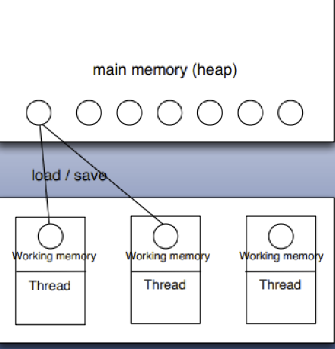

# Java

## 1. 集合


Java中，集合是存储对象最常用的一种方式。学习和熟练使用集合，对开发工作有事半功倍的效果。集合主要分三种类型，分别是List、Map以及Set。

> 数组虽然也可以存储对象，但数组长度固定；集合的长度是可变的。数组可以存储基本类型，但集合只能存储对象。

### List

特点：有序集合，可以存放重复的内容。常用的有两种实现：

* ArrayList：底层是数组，可随机访问，查找方便。
* LinkedList：底层是双向链表，增删方便，查找慢。

以上两种实现，根据其底层使用的数据结构，均有自己的特点。

可以用LinkedList实现LRU算法。

#### 常见问题

1. ArrayList里移除元素，可使用Iterator的remove，不可以使用list remove方法。

### Map

特点：Key-Value键值对。常用实现：

* HashMap:无序键值对，底层是数组+链表。
* LinkedHashMap:有序的，键值对，底层是双向链表
* TreeMap:有序的，底层是红黑树
* ConcurrentHashMap:JDK1.7使用分段锁，1.8使用CAS+synchronized实现

### Set

无序集合。不允许重复。常用实现：

* HashSet:底层实际上使用的是HashMap，存入的值是一个虚拟值。
* TreeSet:底层实际上是基于TreeMap的实现
* LinkedHashSet:

## 2. 多线程

什么是多线程？一个进程中，存在多个线程，并发的执行任务。多线程的目的就是为了更好的利用CPU资源。

并行与并发

* 并行：多个CPU实例或者多台机器同时执行一段处理逻辑，是真正的同时。
* 并发：通过CPU调度算法，让看上去是同时执行，实际从CPU的角度看并不是同时。并发往往在场景中有公用的资源，那么针对公用资源往往产生瓶颈。常用TPS和QPS来反应这个系统的处理能力。


* 线程安全：一段代码，经过多线程使用，线程调度顺序不影响结果。线程不安全，则是线程的调度顺序会影响最终结果。
* 同步：通过人为的控制和调度，保证共享资源在多线程访问下成为线程安全，以此保证结果的准确。

### 线程的状态


### wait、notify、notifyAll


synchronized, wait, notify 是任何对象都具有的同步工具。

wait、notify、notifyAll必须存在与synchronized块中，并且它们针对的是同一个监视器。

### synchronized

* 代码块：获取对象实例的monitor，如果实例相同，那么只有一个线程能执行。
* 直接作用于方法
  * 静态方法：锁定该类的monitor，不同的对象得进行同步。
  * 动态方法：锁定的是该类对象的monitor，不同的对象不影响。

#### volatile

多线程的内存模型：main memory（主存）、working memory（线程栈），在处理数据时，线程会把值从主存load到本地栈，完成操作后再save回去(volatile关键词的作用：每次针对该变量的操作都激发一次load and save)。



volatile还有另一个作用是禁止指令重排序。

针对多线程使用的变量如果不是volatile或者final修饰的，很有可能产生不可预知的结果（另一个线程修改了这个值，但是之后在某线程看到的是修改之前的值）。其实道理上讲同一实例的同一属性本身只有一个副本。但是多线程是会缓存值的，本质上，volatile就是不去缓存，直接取值。在线程安全的情况下加volatile会牺牲性能。

#### 线程类

* Thread类
* Runnable接口
* Callable接口

#### concurrent

##### ThreadLocal

##### 原子类

##### Lock

##### 容器类

##### 管理类

##### fork-join模型

##### 如何实现一个线程池

## 3. JVM

### Java内存区域

* 程序计数器：小块内存空间，当前线程所执行字节码的行号指示器。
* Java虚拟机栈：线程私有，生命周期与线程相同。
* 本地方法栈：为虚拟机使用到的native方法服务。
* Java堆：所有线程共享的内存区域，虚拟机启动时创建。
* 方法区：各个线程共享的内存区域。存储已被虚拟机加载的类信息、常量、静态变量、即时编译器编译后的代码等数据。
* 运行时常量池：方法区的一部分。
* 直接内存：并不是虚拟机运行时数据区的一部分。JDK1.4加入NIO，它可以是使用native函数库直接分配对外内存。

### 对象是否已死

* 引用计数法
* 可达性分析：可做gc roots对象
  * 虚拟机栈
  * 方法区类静态属性引用的对象
  * 方法区常量引用的对象
  * 本地方法栈JNI引用的对象

### 垃圾回收算法

* 标记-清除法
* 复制算法
* 标记-整理算法
* 分代收集算法

### 双亲委派模型


### Java内存模型


## 4. IO&NIO

## 5. 反射

#### 原理

Java反射机制是指在运行状态中，对于任意的一个类，都能够获取到这个类的所有属性和方法；对于任意一个对象，都能够调用它的任意一个方法和属性。这种动态获取信息以及动态调用对象的方法功能，就是Java的反射。

##### 获取Class方式

###### 1. Object类的getClass方法

```Java
// obj代表，代表一个类的对象
Class clz = obj.getClass()
```

###### 2.  静态class属性

```Java 
// Clazz代表任意一个类，
Class clz = Clazz.class
```

###### 3. forName方法

```Java
// forName方法，必须跟真实的带包名的类
try {
  Class clz = Class.forName("com.weiyiysw.Class");
} catch(ClassNotFoundException e) {
  e.printStackTrace();
}
```

总结：常用第三种方法。第一种方法，有对象了，获取类有点多余。第二种，必须导入包。第三种，传入一个字符串即可使用。

#### 使用

可以通过Class对象获取某个类的以下内容：

- 构造方法
- 成员变量
- 成员方法
- 访问成员

批量的方法： 

```Java
//所有”公有的”构造方法  
public Constructor[] getConstructors()
 
//获取所有的构造方法(包括私有、受保护、默认、公有) 
public Constructor[] getDeclaredConstructors() 
```

获取单个的方法，并调用： 

```Java
//获取单个的”公有的”构造方法
public Constructor getConstructor(Class… parameterTypes) 

//获取”某个构造方法”可以是私有的，或受保护、默认、公有； 
public Constructor getDeclaredConstructor(Class… parameterTypes)
```

 调用构造方法： 

```Java
 Constructor–>newInstance(Object… initargs) 
```

获取成员变量并调用： 

 批量的 

```java
// 获取所有的”公有字段” 
Field[] getFields()

// 获取所有字段，包括：私有、受保护、默认、公有；
Field[] getDeclaredFields()
```

获取单个的： 

```Java
// 获取某个”公有的”字段； 
public Field getField(String fieldName)

// 获取某个字段(可以是私有的) 
public Field getDeclaredField(String fieldName)
```

设置字段的值： 

```Java
// 参数说明： 
// obj:要设置的字段所在的对象； 
// value:要为字段设置的值；
Field –> public void set(Object obj,Object value)
```

 获取成员方法并调用： 

批量的： 

```Java
// 获取所有”公有方法”；（包含了父类的方法也包含Object类） 
public Method[] getMethods()
// 获取所有的成员方法，包括私有的(不包括继承的)
public Method[] getDeclaredMethods() 
```

获取单个的：

```Java
public Method getMethod(String name,Class<?>… parameterTypes): 
// 参数
// name : 方法名
// Class … : 形参的Class类型对象 
public Method getDeclaredMethod(String name,Class<?>… parameterTypes) 

```

调用方法： 

```Java
// 参数说明： 
// obj : 要调用方法的对象； 
// args:调用方式时所传递的实参；
Method –> public Object invoke(Object obj,Object… args): 
```

### 代理

#### 1. 静态代理

需要代理对象实现和目标对象一样的接口。

优点：不修改目标对象的前提扩展目标对象

缺点：冗余、不易维护

#### 2. 动态代理

利用了JDK API，动态的在内存中构建代理对象，从而实现对目标对象的代理功能。

动态代理对象不需要实现接口，但是目标对象必须实现接口。

动态代理本质是利用Java反射的能力，获取目标对象的类说明，通过类说明动态生成代理对象，由代理对象执行方法。

#### 3. cglib代理

通过第三方代码类库，运行时在内存中动态生成一个**子类**对象，从而实现目标对象功能的扩展。

Spring AOP使用此代理实现。此方法，会继承目标对象，所以需要重写方法。同时目标类，不能为final类。

## 6. 框架

### 1. Spring系列

#### Spring循环引用

#### Spring事物分析

#### Spring拦截器原理

##### GET方法

##### POST方法

#### Spring MVC原理

#### Spring接口支持返回多格式

#### Spring里的设计模式

### 2. Netty

### 3. Disruptor

### 4. Vert.x

### 5. Guava

## 7. 大数据

## 8. 消息队列

## 9. Redis


